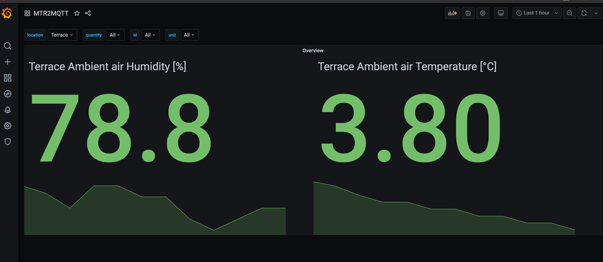

# mtr2grafana

A docker-compose file + sample configs for MTR receiver data visualization in Grafana. Note that since the setup requires serial port direction to docker container on macOS it is required to use docker-machine + virtual box as docker vm.

Services used:
- [mtr2mqtt](https://github.com/tvallas/mtr2mqtt/), for transferring and enriching data from Nokeval MTR series transmitters to MQTT
- [Mosquitto](https://mosquitto.org/), MQTT Broker
- [Telegraf](https://www.influxdata.com/time-series-platform/telegraf/), transmitting data from Mosquitto to database
- [InfluxDB](https://www.influxdata.com/products/influxdb/), time-series database
- [Grafana](https://grafana.com/), time-series visualization tool
- [Grafana Image Renderer](https://grafana.com/docs/grafana/next/image-rendering/), Grafana image rendering
- [Traefik](https://traefik.io/), application proxy

All running in Docker without stuff installed in the host

## Contents

- `docker-compose.yml`, Docker compose file for defining the system 
- `influxdb.evn.template`, template for defining the DB and USER&PASS of Influxdb
- `mosquitto.conf`, mosquitto configuration file
- `telegraf.conf`, telegraf configuration file for transmitting measurements from MQTT to InfluxDB
- `metadata.yml`, sample metadata file for mtr2mqtt
- `grafana/provisioning/dashboards`, files for sample dashboard etc.
- `grafana/provisioning/datasources`, datasource configuration file
- `.env.template`,  sample environment file for configuring Grafana and Traefik

## Usage
1. Add metadata (location, unit, quantity, description) for transmitters in metadata.yml

2. Set password for influxdb 
```bash
cp influxdb.env.template influxdb.env
```
and add the password in the `influxdb.env` file

3. Set the same password for grafana datasource config
```
cp grafana/provisioning/datasources/datasource.yml.template grafana/provisioning/datasources/datasource.yml.
```
and add the pasword in the `grafana/provisioning/datasources/datasource.yml` file

4. Configure .env file for Traefik and Grafana
```
cp .env.template .env
```
and configure the environment variables in `.env` file

5. Get data flowing

```bash
docker-compose up 
```
Check what is happening in the communication

6. Just a demo dashboard is added by default so just continue by creating some nifty dashboards


   
### Running as a service
If you want to run the service in the background use 
```bash
docker-compose up -d
```
to run the Docker compose as a daemon. With `restart: always` set on Docker compose -file, the system should spring up a boot

